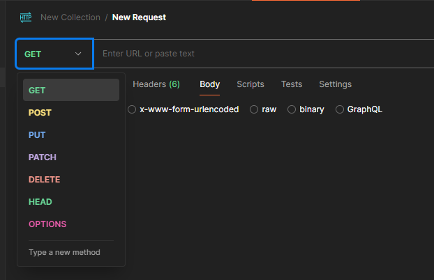

***
# 1.- ¿Para qué usamos clases en Python?
Utilizamos clases en Python para crear objetos. Funcionan como plantillas para crear objetos con las características que se han definido en ella. Son una herramienta fundamental en la programación orientada a objetos. Los nombres de las clases se escriben en el llamado “PascalCase”, es decir, cada palabra que compone el nombre empieza con mayúscula y las palabras no están separadas entre sí (por ejemplo, NombreCompleto).

Para crear una clase en la más simple de sus formas basta con escribir `class`, el nombre de la clase, dos puntos `:`, y después en la siguiente línea añadir los atributos o funciones que queremos que tenga la clase (las clases suelen tener una función `__init__`, pero hablaremos de estos más tarde).

__Sintaxis:__
```python
class NombreClase:
    atributos/funciones
```

Para crear un objeto o instancia escribiremos el nombre del objeto, después `=` y después el nombre de la clase seguido de paréntesis `()`, y de haberlos, con los valores a pasar entre los paréntesis.

__Sintaxis:__
```python
nombre_objeto = NombreClase()
```
__Por ejemplo:__\
*Queremos crear una clase que tenga un atributo que compartirán todas las instancias de la clase, queremos que todas las instancias de esta clase tengan el tipo de cuenta “admin”.*

```python
class Admins:
    account = “admin”

daniel = Admins()
```

***
# 2.- ¿Qué método se ejecuta automáticamente cuando se crea una instancia de una clase?
Al crear una instancia de una clase se ejecuta automáticamente el método dunder `__init__`. Este método, también conocido como constructor, sirve para asignar valores a los atributos del objeto instanciado. 

__Sintaxis:__
```python
class NombreClase:
    def __init__ (self, argumento):
        self.argumento = argumento

objeto = NombreClase(argumento)

print(objeto.argumento)
```

__Por ejemplo:__\
*Queremos una clase que crea un objeto con dos argumentos, un nombre y un apellido.*

```python
class NombreCompleto:
    def __init__ (self, nombre, apellido):
        self.nombre = nombre
        self.apellido = apellido

dani = NombreCompleto(“Daniel”, “Unamuno”)

print(dani.nombre)
print(dani.apellido)
```

***
# 3.- ¿Cuáles son los tres verbos de API?
Los verbos de API o métodos HTTP son unos métodos que se utilizan para indicar la finalidad de la petición API. Los más usados son `GET`, `POST` y `DELETE`. 

- `GET`: Se utiliza para solicitar la visualización de un recurso.

- `POST`: Se utiliza para crear y publicar un nuevo recurso.

- `DELETE`: Se utiliza para eliminar un recurso.

También hay otros métodos HTTP como `PUT`, que se utiliza para actualizar los datos de un recurso.

*** 
# 4.- ¿Es mongoDB una base de datos SQL o NoSQL?
MongoDB es una base de datos NoSQL. Es una base de datos documental y guarda los datos en formato BSON (parecido al formato JSON).

Algunas de las diferencias entre una base de datos SQL y NoSQL:
- Las bases de datos SQL son relacionales, sus datos se almacenan de manera estructurada en tablas; mientras que las bases de datos NoSQL permiten almacenar distintos tipos de información no estructurada, pueden estar orientadas a documentos, pares clave-valor (key-value) o estructuras de grafo (graph).
- Las bases de datos SQL escalan verticalmente, normalmente en un único servidor, y requieren que los usuarios aumenten el hardware físico para aumentar sus capacidades de almacenamiento. Las bases de datos NoSQL ofrecen escalabilidad horizontal, lo que significa que simplemente se necesitan agregar más servidores para aumentar su carga de datos.
- Las bases de datos SQL utilizan SQL (Lenguaje de Consulta Estructurado). Las bases de datos NoSQL utilizan JSON (JavaScript Object Notation), XML, YAML o esquemas binarios.


### MongoDB
Para poder utilizar MongoDB primero tendriamos que instalar tanto [MongoDB](https://www.mongodb.com/try/download/community) como su [Shell](https://www.mongodb.com/try/download/shell) (mongosh) . Después de instalarlos podemos empezar a usarlo entrando a la terminal y escribiendo `mongosh`.

Aquí algunas de las operaciones que podemos hacer:

Ver bases de datos:
```
show dbs
```

Crear o abrir bases de datos:
```
use nombre_basedatos 
``` 

Crear una colección:
``` 
db.createCollection('nombre_coleccion') 
``` 

Ver colecciones:
``` 
show collections
``` 

Insertar un documento a una colección: 
``` 
db.nombre_coleccion.insert({
    datos
})
``` 

***
# 5.- ¿Qué es una API?
Una API (interfaz de programación de aplicaciones) es un conjunto de reglas o protocolos que permite a las aplicaciones comunicarse entre sí. Se podría decir que una API actúa como mensajero, mandando una solicitud a un servidor, traduciendo el mensaje y entregando la respuesta al usuario.

Los 4 tipos principales de API son:
- __API abiertas__\
Las API abiertas son interfaces de programación de aplicaciones de código abierto que se puede acceder con el protocolo HTTP. También se les conoce como API públicas.

- __API de socios__\
Las API de socios conectan a socios comerciales estratégicos. Normalmente, los programadores acceden a estas API en modo de autoservicio a través de un portal público para programadores de API . Aún así, deben completar un proceso de incorporación y obtener credenciales de inicio de sesión para acceder a las API de socios.

- __API internas__\
Las API internas o privadas permanecen ocultas para los usuarios externos. Estas API privadas no están disponibles para usuarios fuera de la empresa. Las organizaciones los utilizan para mejorar la productividad y la comunicación entre diferentes equipos de desarrollo internos.

- __API compuestas__\
Las API compuestas combinan múltiples API de datos o servicios. Permiten a los programadores acceder a varios puntos en una sola llamada. Las API compuestas son útiles en las aplicaciones de microservicios, donde la realización de una única tarea puede requerir información de varias fuentes.

***
# 6.- ¿Qué es Postman?
Postman es una plataforma API que permite a los usuario crear, probar, y gestionar peticiones API. Su función principal es facilitar la realización de peticiones HTTP a APIs, pero permite además:
- Testear colecciones o catálogos de APIs
- Organizar en carpetas, funcionalidades y módulos los servicios web.
- Gestionar el ciclo de vida de nuestra API.
- Generar documentación de nuestras APIs.
- Trabajar con entornos en la nube.



Permite el uso de diferentes métodos HTTP (además de los que hemos visto en el punto 3):
- `GET`: Obtener o leer información.
- `POST`: Agregar o crear información.
- `PUT`: Actualizar o reemplazar información.
- `PATCH`: Actualizar datos específicos.
- `DELETE`: Borrar información.

***
# 7.- ¿Qué es el polimorfismo?
El polimorfismo aplicado a las clases en Python es la capacidad de un mismo método de tener diferentes comportamientos dependiendo de su uso. Es una característica muy ligada a la herencia en clases, y mejora la flexibilidad y comprensión del código.

__Por ejemplo:__\
*Queremos saber las distancias que deben tener entre ellas las diferentes plantas, y para ello queremos que haya clases para cada una de las plantas las cuales heredarán de la clase base “Plantas” la función “distancia” que nos dará diferentes respuestas según la planta que sea.*

```python
class Plantas:
    def distancia(self):
        pass

class Tomate(Plantas):
    def distancia(self):
        return "60 x 90"
    
class Calabacin(Plantas):
    def distancia(self):
        return "100 x 100"
    
tomate = Tomate()
calabacin = Calabacin()

print(tomate.distancia())
print(calabacin.distancia())
```

***
# 8.- ¿Qué es un método dunder?
Un método dunder, también llamado método mágico, es un tipo de método exclusivo a las clases que contiene dos barras bajas `_` al principio y al final de su nombre. Son métodos con diferentes funcionalidades, el más usado siendo `__init__` (mira el punto 2). 

Otros métodos dunder muy usados son:
- `__str__`: Nos devuelve la información como cadena (string). Se utiliza para poder visualizar los objetos de forma comprensible para el usuario.

__Por ejemplo:__\
*Si creamos una clase llamada “Usuario” al cual queremos pasar el argumento “nombre”.*
```python
class Usuario:
    def __init__(self, nombre):
        self.nombre = nombre
        
usuario1 = Usuario('Daniel')

print(usuario1)
```
*Nos devolverá el objeto, que se vera algo asi:*
```python
<__main__.Usuario object at 0x000001A329647380>
```
*Pero si usamos el método __str__ y pedimos que nos devuelva el nombre.*
```python
class Usuario:
    def __init__(self, nombre,):
        self.nombre = nombre
    
    def __str__(self):
        return self.nombre     

usuario1 = Usuario('Daniel')

print(usuario1)
```
*Nos devolverá el nombre como string.*
```python
Daniel
```
- `__repr__`: funciona de una forma parecida a `__str__` pero nos devuelve el texto bruto, sin procesar. Se utiliza más para comprobar que el código no tenga errores, a diferencia que `__str__` que se utiliza más para la representación para usuarios.

- `__len__`: se utiliza para devolver la longitud de un objeto.

__Por ejemplo:__\
*Creamos una clase llamada "GrupoPerros" al que pasaremos una lista de perros. Usaremos `__len__` para ver la cantidad de perros que hay en el grupo.*
```python
class GrupoPerros:
    def __init__(self, perros):
        self.perros = perros
    
    def __len__(self):
        return len(self.perros)

grupo1 = GrupoPerros(["Kuba", "Indi", "Argi", "Izar"])
print(len(grupo1))
```
*Nos devolvera el numero de perros:*
```python
4
```

***
# 9.- ¿Qué es un decorador de python?
Un decorador de python es una herramienta que nos permite modificar el comportamiento de una función sin manipular el código original. Para utilizar un decorador basta con poner `@` y el nombre del decorador encima de la función que queremos decorar.

__Sintaxis:__
```python
@decorador
def funcion():
	resultado
```
Podemos utilizar decoradores predeterminados como `@property` o crear nuestros propios decoradores. 

__Vamos a probar a crear nuestro propio decorador:__\
*Primero vamos a crear el decorador. Se crea un función que tiene una función (func) como argumento. Después creamos la funcionalidad que queremos que tenga el decorador, que en este caso incluye que nos imprima el texto “Funcionalidad extra” y que cumpla también la función original de la función a decorar, y después hacemos que nos devuelva el resultado.*
```python
def decorador(func):
    def funcion_nueva():
        print("Funcionalidad extra")
        func()
    return funcion_nueva
```
*Ahora vamos a decorar una función. La función simplemente imprime el texto “Funcionalidad inicial”, pero como lo hemos decorado con la función que hemos definido antes, ahora funcionará diferente. Después llamaremos la función para ver el resultado de la función decorada.*
```python
@decorador
def funcion_inicial():
    print("Funcionalidad inicial")

funcion_inicial()
```
*El resultado debería ser algo así:*
```python
Funcionalidad extra
Funcionalidad inicial
```
***